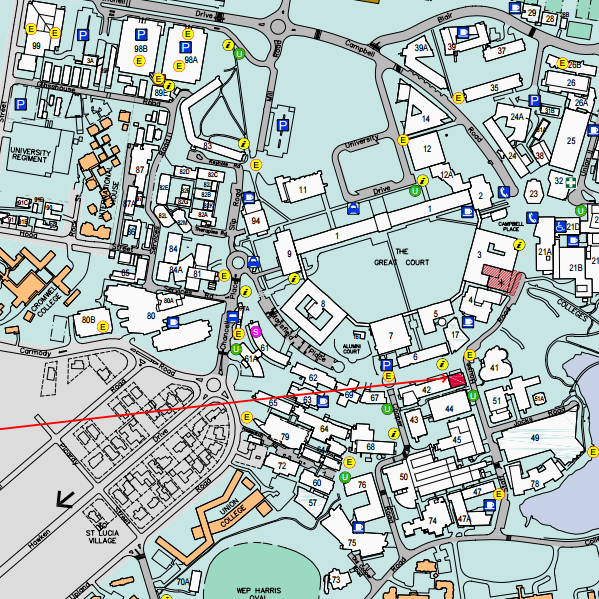

# Model UQ
## Thomas Cranny

---

## What?
Visualise the UQ St. Lucia Campus in 3D.

---

## Why?
- Logical extension of previous topic. 
- Display UQ spatially
    - Better comprehension then 2D map provides.
- Interesting and relevant visualisation.

Note: Not a direct continuation of previous topic, just the theme. 

--

--

<!-- .slide: data-background-video="media/images/presentation/3dvid.m4v" -->

---

## How?
- WebGL, an OpenGL subset, for modern browsers.
- Using:
    - three.js javascript library.
    - GLSL shaders.

---

## Main Techniques
- Modeling:
    - Mesh Hierarchies.
    - Constructive Geometry.
- Texturing & Lighting:
    - Texture and Bump mapping.
    - Shadowing.
    - Skybox.
    - Shaders.
- Interactivity:
    - Orbit controls (zooming, panning, rotating).

---

# [Demo](index.html)